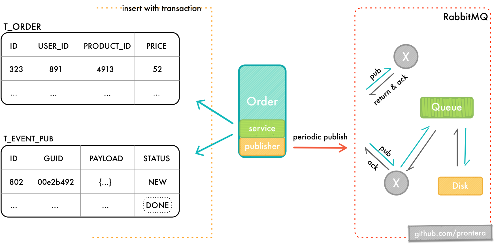
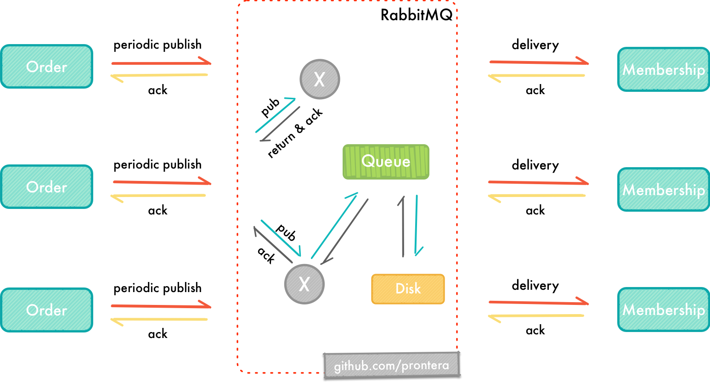
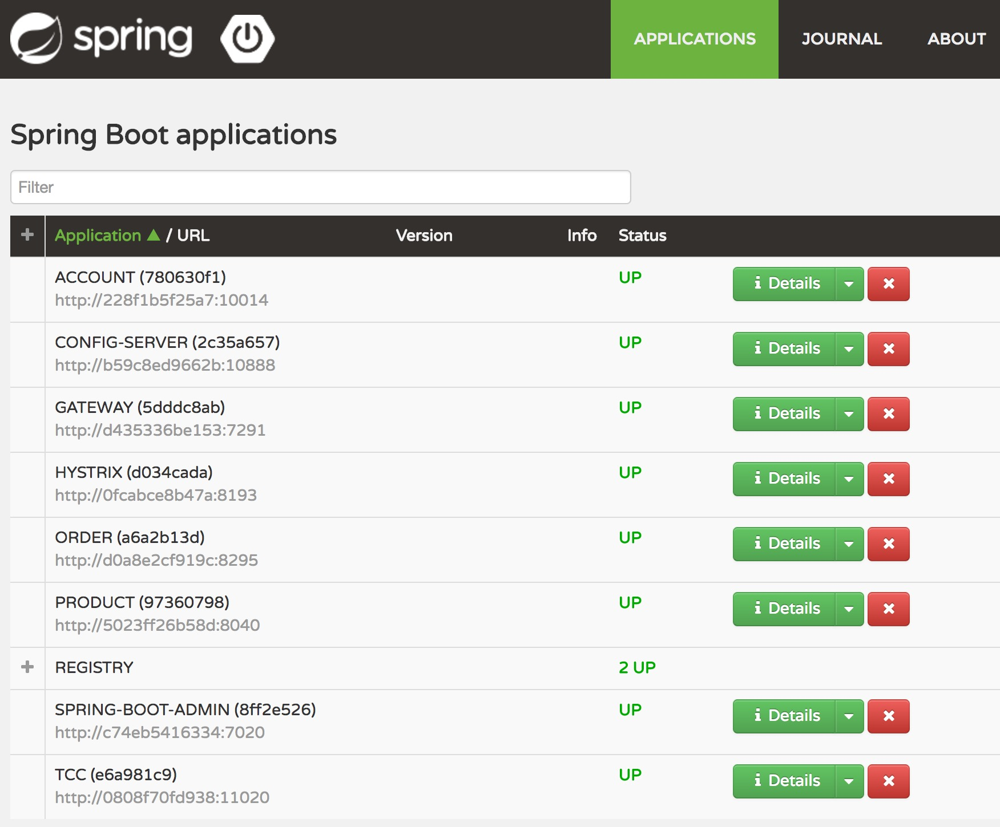
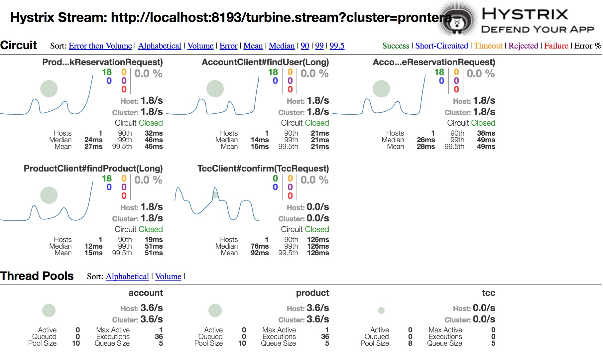
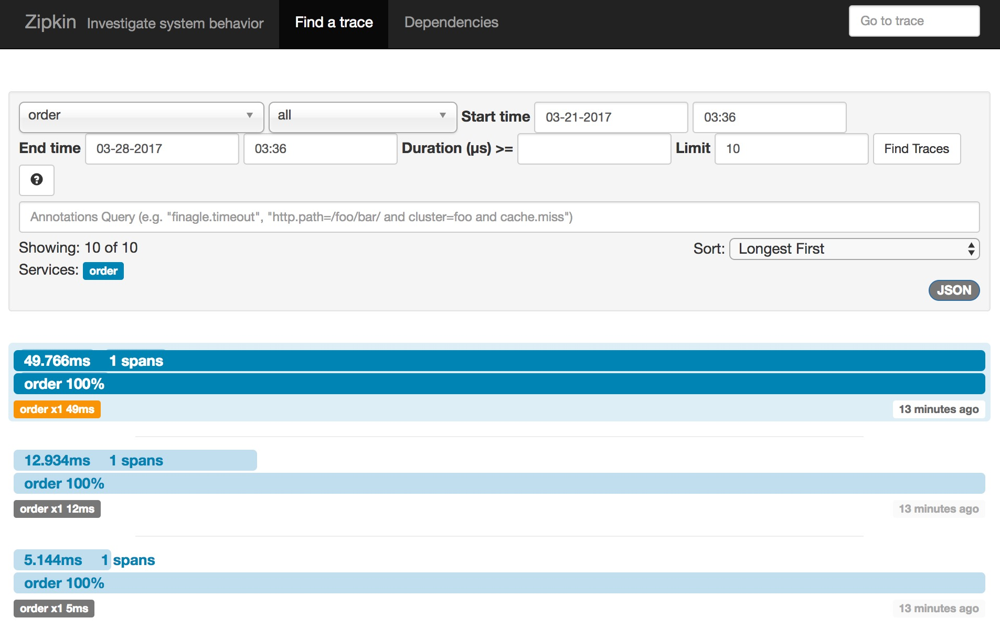
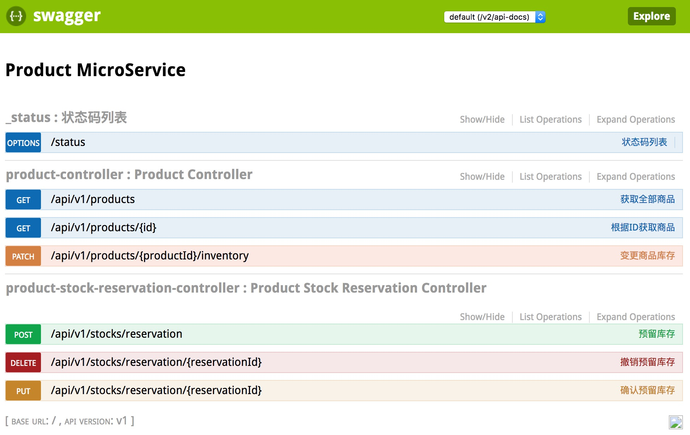
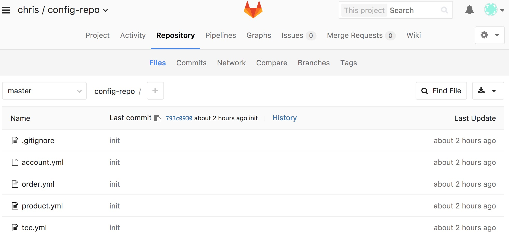

# Solar

Spring Cloud为开发者提供了快速构建分布式系统中的一些常见工具，如分布式配置中心，服务发现与注册中心，智能路由，服务熔断及降级，消息总线，分布式追踪的解决方案等。

本次实战以模拟下单流程为背景，结合Spring Cloud Netflix和分布式事务解决方案中Try Confirm Cancel模式与基于事件驱动的服务架构作为实战演示。

## 开发环境

- Docker 1.13.1
- Docker Compose 1.11.1
- Docker MySQL 5.7.17
- Docker RabbitMQ 3.6.6
- Java8 with JCE
- Spring Cloud Camden.SR6

## 系统结构


## Try Confirm Cancel 补偿模式

本实例遵循的是Atomikos公司对微服务的分布式事务所提出的[RESTful TCC](https://www.atomikos.com/Blog/TransactionManagementAPIForRESTTCC)解决方案。

RESTful TCC模式分3个阶段执行

1. Trying阶段主要针对业务系统检测及作出预留资源请求，若预留资源成功，则返回确认资源的链接与过期时间。
2. Confirm阶段主要是对业务系统的预留资源作出确认，要求TCC服务的提供方要对确认预留资源的接口实现幂等性，若Confirm成功则返回204，资源超时则证明已经被回收且返回404。
3. Cancel阶段主要是在业务执行错误或者预留资源超时后执行的资源释放操作，Cancel接口是一个可选操作，因为要求TCC服务的提供方实现自动回收的功能，所以即便是不认为进行Cancel，系统也会自动回收资源。

## Event Driven Architecture 基于事件驱动架构

本实例中的order-ms与membership-ms之间的通信是基于事件驱动的。当订单被成功创建并且付款成功之后，该订单的部分信息将会发往membership-ms以进行积分的增加。

从系统层面看，order-ms在EDA中是属于Publisher角色，自然而然地membership-ms就是Subscriber。

Publisher中的事件状态转换如下：

- NEW —> PENDING —> DONE


- NEW —> PENDING —> FAILED / NO_ROUTE / NOT_FOUND / ERROR

  

Subscriber中的事件状态转换如下：

- NEW —> DONE

- NEW —> FAILED / NOT_FOUND / ERROR

  

部分功能介绍：

1. Publisher发送消息之前先将消息落地，目的是防止消息的错误发布（业务数据被回滚而消息却发布至Broker）。
2. Publisher会周期性地扫描NEW状态的消息，并发布至Broker。
3. 启用mandatory与publisher confirms机制，在消息被持久化至磁盘后将会收到basic.ack，此时可选择将消息转换为DONE或者是直接将其删除。
4. Publisher将消息发布至Broker后会将其状态由NEW更新为PENDING，PENDING状态的事件将会由另一定时器扫描在当前时钟的3秒之前发布，但是却并未得到basic.ack的事件，并重新发布至Broker。意在消除在单实例的情况下因crash而导致消息状态丢失的边缘情况。
5. Subscriber的消息幂等性。

### 基础组件

#### Zuul Gateway

Zuul在本实例中仅作为路由所使用，配置降低Ribbon的读取与连接超时上限。

#### Eureka H.A.

多个对等Eureka节点组成高可用集群，并将注册列表的自我保护的阈值适当降低。

#### Config Server

- 如果远程配置中有密文`{cipher}*`，那么该密文的解密将会延迟至客户端启动的时候. 因此客户端需要配置AES的对称密钥`encrypt.key`，并且客户端所使用的JRE需要安装[Java 8 JCE](http://www.oracle.com/technetwork/java/javase/downloads/jce8-download-2133166.html)，否则将会抛出`Illegal key size`相关的异常。
  (本例中Docker Compose构建的容器已经安装了JCE，如果远程配置文件没有使用`{cipher}*`也不必进行JCE的安装)


- 为了达到开箱即用，选用公开仓库Github或者GitOsc。

- 本项目中有两个自定义注解
  `@com.github.prontera.Delay` 控制方法的延时返回时间；

  `@com.github.prontera.RandomlyThrowsException` 随机抛出异常，人为地制造异常。

  默认的远程配置如下

  ```yaml
  solar:
    delay:
      time-in-millseconds: 0
    exception:
      enabled: false
      factor: 7
  ```

  这些自定义配置正是控制方法返回的时延，随机异常的因子等。

  我在服务`order`，`product`，`account`和`tcc`中的所有Controller上都添加了以上两个注解，当远程配置的更新时候，可以手工刷新`/refresh`或通过webhook等方法自动刷新本地配置. 以达到模拟微服务繁忙或熔断等情况。

#### RabbitMQ

原本作为可靠性事件投递的Broker，如今被TCC模式所替代. 可为日后的Spring Cloud Steam或Spring Cloud Bus的集成作为基础组件而保留。

### 监控服务

#### Spring Boot Admin

此应用提供了管理Spring Boot服务的简单UI，下图是在容器中运行时的服务健康检测页



#### Hystrix Dashboard

提供近实时依赖的统计和监控面板，以监测服务的超时，熔断，拒绝，降级等行为。



#### Zipkin Server

Zipkin是一款开源的分布式实时数据追踪系统，其主要功能是聚集来自各个异构系统的实时监控数据，用来追踪微服务架构下的系统时延问题. 下图是对`order`服务的请求进行追踪的情况。



### 业务服务

首次启动时通过Flyway自动初始化数据库。

对spring cloud config server采用fail fast策略，一旦远程配置服务无法连接则无法启动业务服务。

#### account

用于获取用户信息，用户注册，修改用户余额，预留余额资源，确认预留余额，撤销预留余额。

#### product

用于获取产品信息，变更商品库存，预留库存资源，确认预留库存，撤销预留库存。

#### tcc coordinator

TCC资源协调器，其职责如下：

- 对所有参与者发起Confirm请求。
- 无论是协调器发生的错误还是调用参与者所产生的错误，协调器都必须有自动恢复重试功能，尤其是在确认的阶段，以防止网络抖动的情况。

#### order

**`order`服务是本项目的入口**，尽管所提供的功能很简单：

- 下单. 即生成预订单，为了更好地测试TCC功能，在下单时就通过Feign向服务`account`与`product`发起预留资源请求，并且记录入库。
- 确认订单. 确认订单时根据订单ID从库中获取订单，并获取预留资源确认的URI，交由服务`tcc`统一进行确认，如果发生冲突即记录入库，等待人工处理。


#### membership

用于订单付款成功后，对下单用户的积分进行增加操作。该服务与订单服务是基于消息驱动以进行通信，达到事务的最终一致性。

### Swagger UI

下图为`product`服务的Swagger接口文档，根据下文的服务字典可知，本接口文档可通过`http://localhost:8040/swagger-ui.html`进行访问.  `order`，`account`和`tcc`的文档访问方式亦是如出一撤。



## 运行

#### Docker Compose运行

在项目根路径下执行脚本`build.sh`，该脚本会执行Maven的打包操作，并会迭代目录下的`*-compose.yml`进行容器构建。

构建完成后需要按照指定的顺序启动：

1. 启动MySQL，RabbitMQ等基础组件

   ```shell
   ➜  solar git:(feature/cleanup) ✗ docker-compose -f infrastructure-compose.yml up -d
   ```

2. 启动Eureka Server与Config Server

   ```shell
   ➜  solar git:(feature/cleanup) ✗ docker-compose -f basic-ms-compose.yml up -d
   ```

3. 启动监控服务

   ```shell
   ➜  solar git:(feature/cleanup) ✗ docker-compose -f monitor-ms-compose.yml up -d
   ```

4. 启动业务服务

   ```shell
   ➜  solar git:(feature/cleanup) ✗ docker-compose -f business-ms-compose.yml up -d
   ```

#### IDE运行

因为程序本身按照Docker启动，所以对于hostname需要在hosts文件中设置正确才能正常运行：

```shell
## solar
127.0.0.1 eureka1
127.0.0.1 eureka2
127.0.0.1 rabbitmq
127.0.0.1 zipkin_server
127.0.0.1 solar_mysql
127.0.0.1 gitlab
```

根据依赖关系，程序最好按照以下的顺序执行

docker mysql > docker rabbitmq > eureka server > config server > zipkin server > 其他微服务

## 示例

根据附表中的服务字典，我们通过Zuul或Swagge对`order`服务进行预订单生成操作。

```http
POST http://localhost:7291/order/api/v1/orders
Content-Type: application/json;charset=UTF-8

{
  "product_id": 7,
  "user_id": 1
}
```

成功后我们将得到预订单的结果

```json
{
  "data": {
    "id": 15,
    "create_time": "2017-03-28T18:18:02.206+08:00",
    "update_time": "1970-01-01T00:00:00+08:00",
    "delete_time": "1970-01-01T00:00:00+08:00",
    "user_id": 1,
    "product_id": 7,
    "price": 14,
    "status": "PROCESSING"
  },
  "code": 20000
}
```

此时我们再确认订单

(如果想测试预留资源的补偿情况，那么就等15s后过期再发请求，注意容器与宿主机的时间)

```http
POST http://localhost:7291/order/api/v1/orders/confirmation
Content-Type: application/json;charset=UTF-8

{
  "order_id": 15
}
```

如果成功确认则返回如下结果

```json
{
  "data": {
    "id": 15,
    "create_time": "2017-03-28T18:18:02.206+08:00",
    "update_time": "2017-03-28T18:21:32.78+08:00",
    "delete_time": "1970-01-01T00:00:00+08:00",
    "user_id": 1,
    "product_id": 7,
    "price": 14,
    "status": "DONE"
  },
  "code": 20000
}
```

至此就完成了一次TCC事务，当然你也可以测试超时和冲突的情况，这里就不再赘述。

## 拓展

### 使用Gitlab作为远程配置仓库

本例中默认使用Github或GitOsc中的公开仓库，出于自定义的需要，我们可以在本地构建Git仓库，这里选用Gitlab为例。

将以下配置添加至docker compose中的文件中并启动Docker Gitlab容器：

```yaml
gitlab:
    image: daocloud.io/daocloud/gitlab:8.16.7-ce.0
    ports:
        - "10222:22"
        - "80:80"
        - "10443:443"
    volumes:
        - "./docker-gitlab/config/:/etc/gitlab/"
        - "./docker-gitlab/logs/:/var/log/gitlab/"
        - "./docker-gitlab/data/:/var/opt/gitlab/"
    environment:
        - TZ=Asia/Shanghai
```

将项目的`config-repo`添加至Gitlab中，并修改`config-ms`中git仓库的相关验证等参数即可。



## 服务字典

鉴于Spring Boot Actuator的端点所带来的两面性，除了可以增加`spring-boot-starter-security`来获得强度较弱的HTTP Basic认证外，我们还可以修改`management.port`和`management.context-path`来提高攻击成本. 是的，我对每一个服务都修改了以上两个属性，并且兼容了Eureka Server，Hystrix Dashboard，Spring Boot Admin，使这些监控服务仍能正确工作. 因为对以上两个参数修改，我们的监控路径有所变化，如下表：

|     module name      | docker compose service name | application name  | server port | management port |         management context path          | scalable |
| :------------------: | :-------------------------: | :---------------: | :---------: | :-------------: | :--------------------------------------: | :------: |
|      account-ms      |           account           |      account      |    10014    |      10248      | **/78d504ff-82e8-4a87-82e8-724d72d1171b** |          |
|    api-gateway-ms    |           gateway           |      gateway      |    7291     |      10211      |  /fb83deee-dd46-472b-99a9-f0ebffe20d0e   |          |
|      config-ms       |        config_server        |   config-server   |    10888    |      10481      |  /f7597180-e480-400e-81a0-847c22e2e0b8   |          |
| eureka-registry-ms-1 |           eureka1           |     registry      |    8763     |      9274       |  /55395018-70b7-47c3-8fef-5bf24c9da9af   |    ×     |
| eureka-registry-ms-2 |           eureka2           |     registry      |    8762     |      10177      |  /e5da837b-a575-4447-b037-100850226a11   |    ×     |
| hystrix-dashboard-ms |      hystrix_dashboard      |      hystrix      |    8193     |      7104       |  /9511d89d-6488-4293-8df8-c4feb8681e83   |          |
|    membership-ms     |         membership          |    membership     |    10673    |      10391      |  /a6da3b6f-4b59-11e7-9226-0242ac130004   |          |
|       order-ms       |            order            |       order       |    8295     |      10848      | **/78d504ff-82e8-4a87-82e8-724d72d1171b** |          |
|      product-ms      |           product           |      product      |    8040     |      10912      | **/78d504ff-82e8-4a87-82e8-724d72d1171b** |          |
| spring-boot-admin-ms |      spring_boot_admin      | spring-boot-admin |    7020     |      9218       |  /e58a0ff5-9f60-4545-9aa2-2b91c8a6d53b   |          |
|  tcc-coordinator-ms  |       tcc_coordinator       |        tcc        |    11020    |      12841      | **/78d504ff-82e8-4a87-82e8-724d72d1171b** |          |
|      zipkin-ms       |        zipkin_server        |   zipkin-server   |    9411     |        -        |                    -                     |    ×     |

## 结语

感谢你的耐心阅读，如有对本项目中的Spring Cloud的使用或者对本人的编码风格有更好的想法或者建议，欢迎通过邮件与我取得联系，万分感谢。